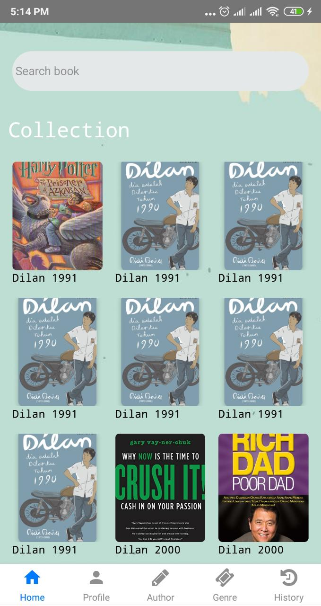
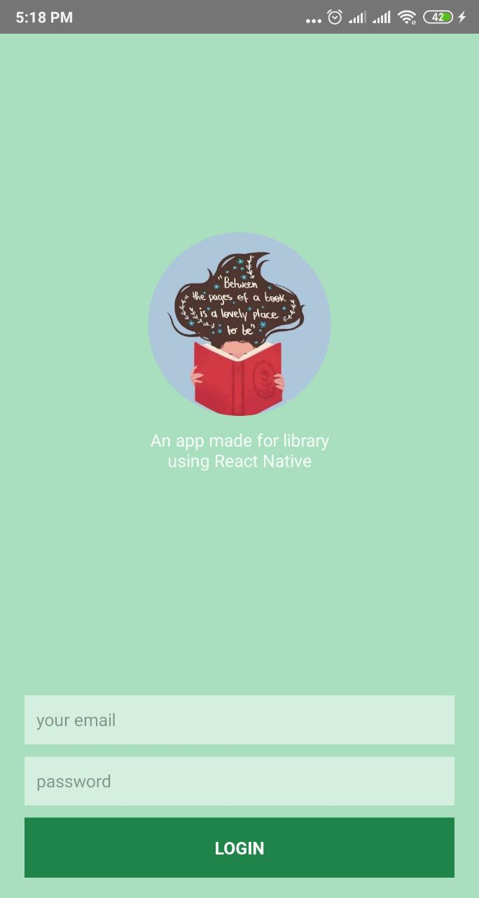
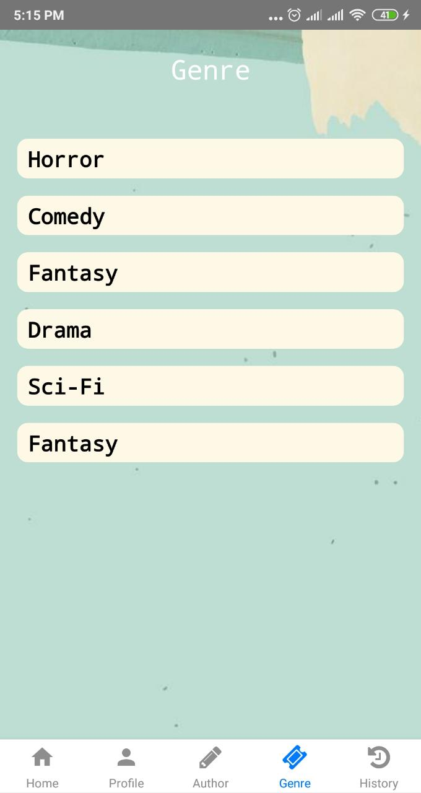
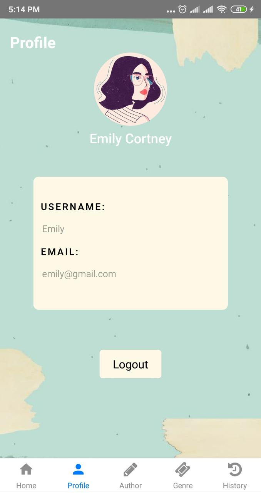

<h1 align="center">Library App 📚</h1>

  

  Built with React Native.

## Table of Contents

- [Introduction](#introduction)
- [Features](#features)
- [Requirements](#requirements)
- [Usage](#usage-for-development)
- [Screenshots](#screenshots)

## Introduction
<b>Library App</b> is a mobile app based library application where we can monitor what books are in the library, we can also borrow books there

## Features

* Searching book
* Booking book
* History booking
* Show account

## Requirements
* [`npm`](https://www.npmjs.com/get-npm) or [`yarn`](https://yarnpkg.com/getting-started/install)
* [`react-native`](https://facebook.github.io/react-native/docs/getting-started)
* [`react-native-cli`](https://facebook.github.io/react-native/docs/getting-started)

## Usage for development
1. Open your terminal or command prompt
2. Type `git clone https://github.com/RinaLia/library-reactnative.git`
3. Open the folder and type `npm install or yarn install` for install dependencies
4. Type `react-native run-android` for run this app. ***Make sure your device is connected with debugging mode***.

## Screenshot App

<kbd>

</kbd>

<kbd>

</kbd>

<kbd>

</kbd>

<kbd>

</kbd>

